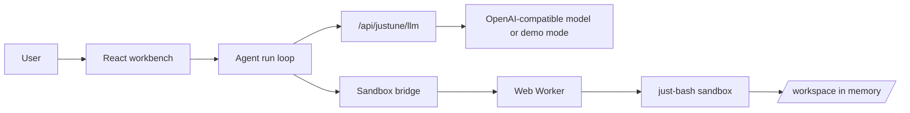
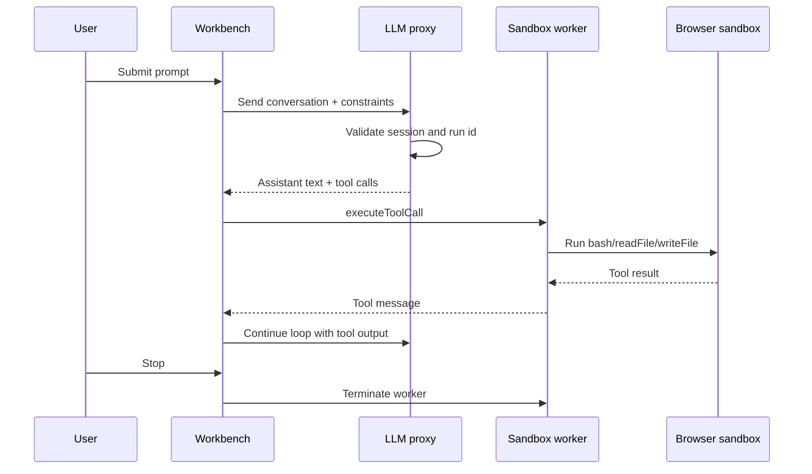

# justune

[English](README.md)  [简体中文](README_CN.md)

`justune` is a browser-hosted agent runtime for local code and file work. It keeps planning on the server and runs tools inside the user's browser workspace, so you can test client-side tool calling without giving the server direct access to the user's files.

The app now consumes its reusable runtime surface through the local package-style entry `@lemmair/justune-runtime`, backed by [`packages/justune-runtime`](/root/projects/justune/packages/justune-runtime). Legacy `lib/*` runtime paths now exist only as thin compatibility shims, so the package sources are the single implementation surface.

## Preview


## The problem it solves

Most agent products send both reasoning and tool execution to a server. That model is simple, but it creates three problems:

- The server becomes a high-trust execution surface.
- Tool activity is harder for the user to inspect and interrupt.
- Browser-based products still depend on remote execution to do local work.

`justune` explores a different split:

- The server only brokers model turns and session validation.
- The browser owns the workspace, tool execution, change tracking, and recovery.
- A Web Worker contains sandbox execution so `Stop` and `Reset` can terminate in-flight work.

## Design principles

- Keep the trust boundary narrow. The server should not touch the browser workspace.
- Make every tool action observable. Users should be able to inspect tool calls, outputs, timings, and file changes.
- Fail safely. Paths, file types, output size, write size, and command duration are all constrained.
- Recover cleanly. Interrupted runs should restore state without corrupting the workspace.
- Stay small and composable. The runtime should be easy to replace, adapt, and embed.

## Architecture





## How it works

- The UI consumes a headless `JustuneRuntime` controller from `@lemmair/justune-runtime`.
- The server exposes two Node routes:
  - `POST /api/session` creates or restores a session.
  - `POST /api/justune/llm` validates the session, validates conversation tool names, clamps runtime constraints, and requests the next model turn.
- The browser holds the workspace in memory at `/workspace`.
- A Web Worker owns the `JustuneBrowserSandbox` instance.
- The worker accepts typed requests for:
  - `executeToolCall`
  - `getChanges`
  - `getWorkspacePaths`
  - `exportPatch`
  - `exportChangeSetJson`
  - `exportWorkspaceFiles`
  - `exportRunLog`
- IndexedDB persists messages, tool logs, workspace files, queued prompts, and interrupted-run state.

## Features

- Browser-local `bash`, `readFile`, `writeFile`, `readFileRange`, `replaceInFile`, `applyPatch`, `listWorkspacePaths`
- Web Worker-backed sandbox execution with deterministic timeout recovery
- Stop/reset that can terminate in-flight tool execution
- Session restore with `clientId`, `sessionId`, and `sessionSecret`
- Tool-call de-duplication by `toolCallId`
- File change tracking with patch and JSON export
- Workspace import via snapshot JSON, change-set JSON, or unified diff patch
- Workspace snapshot export as JSON
- Observable tool log with status, timing, and result previews
- Prompt queueing and resume after interruption
- Demo mode when no live model is configured
- OpenAI-compatible LLM integration
- Headless runtime API for boot/run/resume/stop/export flows
- Runtime constraint clamping on the server
- Server-side validation of tool names and tool-call input shapes in the LLM proxy
- Local sandbox policy for dangerous commands, sensitive files, path escapes, timeouts, and output limits
- Run-level data budgets (read/write/output byte caps)
- Uniform sensitive-file blocking across `bash` and file tools

## Security model

This project is designed as a local MVP, not a hardened multi-tenant platform.

- The browser sandbox is the final authority for file access and command execution.
- The server rejects unsupported or malformed tool calls before they reach the browser.
- Session bootstrap and LLM turns are protected by same-origin checks, a session secret cookie, and a per-session CSRF token.
- All workspace activity is scoped to `/workspace`.
- Sensitive files such as `.env` are blocked from reads via `bash` and file tools uniformly.
- Writes outside the workspace are rejected.
- Tool timeouts terminate the worker and reboot from a workspace snapshot.
- Run-level budgets cap total bytes read, output, and written across a session.
- The session store is rate-limited and can optionally persist to a local JSON file for single-instance Node deployments; it is still not a distributed production store.

## Run locally

```bash
npm install
npm run dev
```

Open `http://localhost:3000`.

## Environment

Live model calls are optional. If the provider is not configured, the app runs in deterministic demo mode.

```bash
JUSTUNE_LLM_API_KEY=...
JUSTUNE_LLM_MODEL=gpt-4o-mini

# Optional for OpenAI-compatible gateways
JUSTUNE_LLM_BASE_URL=https://api.openai.com/v1

# Optional for single-instance durable session restore
JUSTUNE_SESSION_STORE_FILE=.data/justune-sessions.json

# Optional for distributed session storage over Redis REST / Upstash
JUSTUNE_SESSION_REDIS_REST_URL=https://...
JUSTUNE_SESSION_REDIS_REST_TOKEN=...
```

## Deploy

### Vercel

`justune` is a Next.js app and deploys cleanly to Vercel.

1. Import the `justune` directory as a project.
2. Set:
   - `JUSTUNE_LLM_API_KEY`
   - `JUSTUNE_LLM_MODEL`
   - optionally `JUSTUNE_LLM_BASE_URL`
3. Deploy with the default Node runtime.

Notes:

- The API routes explicitly use the Node runtime.
- Session state is instance-local by default. If you set `JUSTUNE_SESSION_STORE_FILE`, a single Node instance can restore sessions from disk. If you set `JUSTUNE_SESSION_REDIS_REST_URL` and `JUSTUNE_SESSION_REDIS_REST_TOKEN`, the app can use a shared Redis REST store across instances.

### Any Node host

```bash
npm install
npm run build
npm start
```

Requirements:

- A Node environment that can run Next.js
- Browser support for Web Workers and IndexedDB

## Integrate it

There are three main integration seams.

### 1. Swap the model provider

The server-side LLM adapter lives in `lib/llm.ts`.

- It accepts OpenAI-compatible chat completions.
- It maps the internal conversation format to provider messages.
- It converts provider tool calls into the local tool contract.

To integrate another provider, replace the request and response mapping in `lib/llm.ts` while preserving the `LlmResponseBody` shape.

### 2. Change or extend the tool surface

The local tool contract is defined in `@lemmair/justune-runtime` and implemented in the package sources under [`packages/justune-runtime/src`](/root/projects/justune/packages/justune-runtime/src). The current tool names are:

- `bash`
- `readFile`
- `readFileRange`
- `writeFile`
- `replaceInFile`
- `applyPatch`
- `listWorkspacePaths`

To add a tool:

1. Extend the protocol types.
2. Add the tool definition in `lib/llm.ts`.
3. Implement it in `lib/justune-browser-sandbox.ts`.
4. Expose it through the worker protocol and client bridge.
5. Update the workbench log and tests.

### 3. Embed the runtime or workbench in another product

The intended public runtime entry point is `@lemmair/justune-runtime`, with source in [`packages/justune-runtime/src/index.ts`](/root/projects/justune/packages/justune-runtime/src/index.ts). The demo UI entry point is [`components/justune-workbench.tsx`](/root/projects/justune/components/justune-workbench.tsx).

You can integrate `justune` as:

- a standalone internal tool
- a demo surface for client-side agent execution
- a reference implementation for browser-owned tool calling

Today this repo is still a Next.js app, not a published npm package, but the app now consumes the runtime through the package-style alias so the extraction boundary is explicit.

If you embed it in a larger product, keep the current trust split:

- server: sessions, rate limits, model access
- browser: workspace, tools, exports, recovery

## Runtime limits

Default hard limits:

- workspace root: `/workspace`
- command timeout: `30000ms`
- max stdout/stderr: `30000` characters
- max file read: `200000` characters
- max single write: `120000` bytes

The server clamps client-provided constraints to safe bounds before forwarding a model turn.

## Production hardening

If you want to move beyond a demo or controlled internal environment, start here:

- If you only need single-instance durability, set `JUSTUNE_SESSION_STORE_FILE` to persist sessions to disk. If you need shared state now, configure the Redis REST env vars. If you need a broader production posture, you can still swap that for Redis, Postgres, or another durable store behind the same server-side session API.
- The LLM proxy already enforces tool names and input shapes, and validates inbound conversation and tool-result sizes before sending them to the model provider. Keep the browser sandbox as the final authority for actual execution.
- The current session layer already applies per-session request, turn, and conversation quotas and records a bounded audit trail. For broader production use, add real authentication, externalized audit retention, and deployment-level abuse controls instead of relying on a trusted local environment.

## Verification

```bash
npm test
npm run lint
npm run typecheck
npm run build
```
## Links

[just-bash](https://github.com/vercel-labs/just-bash)
