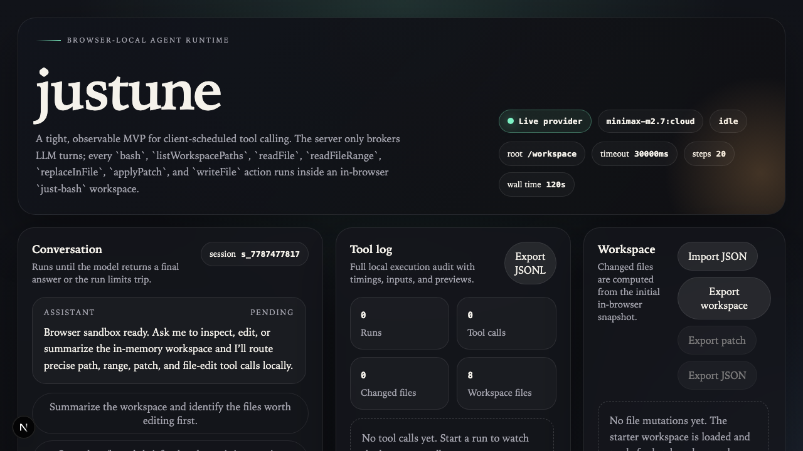
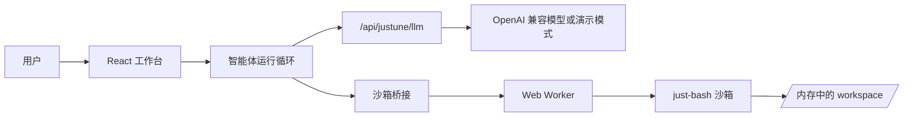
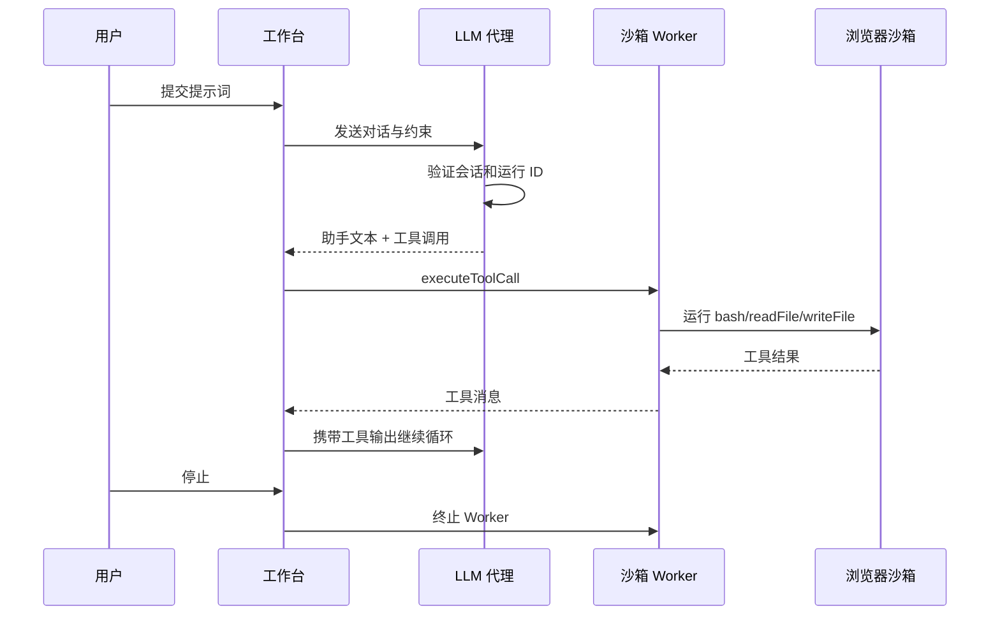

# justune

[English](README.md)  [简体中文](README_CN.md)

`justune` 是一个运行在浏览器中的智能体运行时，用于本地代码和文件操作。它的规划逻辑在服务端执行，而工具操作则在用户的浏览器工作空间中运行——这样既能在不暴露用户文件的前提下测试客户端工具调用，又保证了数据安全。

目前，应用通过本地包入口 `@lemmair/justune-runtime` 消费可复用的运行时接口，底层实现来自 [`packages/justune-runtime`](/root/projects/justune/packages/justune-runtime)。原有的 `lib/*` 路径已退化为薄兼容层，包源码成为唯一的实现来源。

## 预览



## 为什么需要 justune

大多数智能体产品把推理和工具执行都交给服务器。这种模式虽然简单，却带来三个隐患：

- 服务器成为高信任执行面，安全风险集中
- 用户难以检查和中断工具活动，缺乏透明度
- 浏览器端产品仍依赖远程执行本地任务，架构有缺陷

`justune` 采用另一种思路：

- 服务端仅负责模型对话和会话验证
- 浏览器端掌控工作空间、工具执行、变更追踪和故障恢复
- Web Worker 隔离沙箱执行，「停止」和「重置」可立即终止进行中的任务

## 设计原则

- **信任边界最小化**：服务器不应触碰浏览器工作空间
- **全程可观察**：每个工具调用、输出、耗时、文件变更都可见可查
- **安全失败**：路径、文件类型、输出大小、写入量、命令时长均受约束
- **干净恢复**：中断后能恢复状态，不损坏工作空间
- **小巧可组合**：运行时应易于替换、适配和嵌入

## 架构





## 工作原理

- UI 层通过 `@lemmair/justune-runtime` 使用无头 `JustuneRuntime` 控制器
- 服务端提供两个 Node 路由：
  - `POST /api/session`：创建或恢复会话
  - `POST /api/justune/llm`：验证会话、校验工具名称、限制运行时约束，请求下一轮模型响应
- 浏览器在内存中的 `/workspace` 路径下维护工作空间
- Web Worker 持有 `JustuneBrowserSandbox` 实例，接受以下请求：
  - `executeToolCall`：执行工具调用
  - `getChanges`：获取变更
  - `getWorkspacePaths`：获取工作空间路径列表
  - `exportPatch`：导出补丁
  - `exportChangeSetJson`：导出变更集 JSON
  - `exportWorkspaceFiles`：导出工作空间文件
  - `exportRunLog`：导出运行日志
- IndexedDB 持久化消息、工具日志、工作空间文件、待执行提示词和中断状态

## 功能特性

- 浏览器本地工具：`bash`、`readFile`、`writeFile`、`readFileRange`、`replaceInFile`、`applyPatch`、`listWorkspacePaths`
- Web Worker 沙箱执行，支持确定性超时恢复
- 「停止/重置」可终止进行中的工具执行
- 会话恢复：通过 `clientId`、`sessionId`、`sessionSecret` 恢复上下文
- 工具调用去重（按 `toolCallId`）
- 文件变更追踪，支持补丁和 JSON 格式导出
- 工作空间导入：快照 JSON、变更集 JSON、统一差异补丁
- 工作空间快照导出为 JSON
- 可观察的工具日志：状态、耗时、结果预览一目了然
- 提示词队列，支持中断后继续执行
- 未配置模型时自动进入演示模式
- OpenAI 兼容的 LLM 集成
- 无头运行时 API：完整的启动/运行/恢复/停止/导出流程
- 服务端运行时约束强制限制
- LLM 代理层校验工具名称和调用参数格式
- 本地沙箱策略：拦截危险命令、敏感文件、路径逃逸、超时、输出溢出
- 运行级数据配额（读/写/输出字节上限）
- `bash` 和文件工具统一拦截敏感文件访问

## 安全模型

本项目定位为本地 MVP，而非加固的多租户平台。

- 浏览器沙箱是文件访问和命令执行的最终权威
- 服务端在工具调用到达浏览器前，拦截不支持或格式错误的请求
- 会话引导和 LLM 轮次受同源检查、会话密钥 Cookie、每会话 CSRF 令牌保护
- 所有工作空间活动限定于 `/workspace` 目录
- `.env` 等敏感文件在 `bash` 和文件工具中统一禁止读取
- 拒绝工作空间外的写入操作
- 工具超时后终止 Worker 并从快照重启
- 运行级配额限制会话总读取、输出、写入字节数
- 会话存储有速率限制，可选持久化到本地 JSON 文件支持单实例恢复（但非分布式生产存储）

## 本地运行

```bash
npm install
npm run dev
```

访问 `http://localhost:3000` 即可。

## 环境变量

实时模型调用可选。未配置提供商时，应用自动进入确定性演示模式。

```bash
JUSTUNE_LLM_API_KEY=...
JUSTUNE_LLM_MODEL=gpt-4o-mini

# OpenAI 兼容网关（可选）
JUSTUNE_LLM_BASE_URL=https://api.openai.com/v1

# 单实例持久会话恢复（可选）
JUSTUNE_SESSION_STORE_FILE=.data/justune-sessions.json

# Redis REST / Upstash 分布式会话存储（可选）
JUSTUNE_SESSION_REDIS_REST_URL=https://...
JUSTUNE_SESSION_REDIS_REST_TOKEN=...
```

## 部署

### Vercel

`justune` 是 Next.js 应用，一键部署到 Vercel。

1. 将 `justune` 目录导入为项目
2. 配置环境变量：
   - `JUSTUNE_LLM_API_KEY`
   - `JUSTUNE_LLM_MODEL`
   - 可选：`JUSTUNE_LLM_BASE_URL`
3. 使用默认 Node 运行时部署

注意事项：

- API 路由显式使用 Node 运行时
- 会话状态默认为实例本地存储。设置 `JUSTUNE_SESSION_STORE_FILE` 后，单实例可从磁盘恢复会话。设置 `JUSTUNE_SESSION_REDIS_REST_URL` 和 `JUSTUNE_SESSION_REDIS_REST_TOKEN` 后，可跨实例共享 Redis REST 存储。

### 其他 Node 主机

```bash
npm install
npm run build
npm start
```

要求：

- 支持 Next.js 的 Node 环境
- 浏览器支持 Web Workers 和 IndexedDB

## 集成方式

三个主要集成切入点：

### 1. 替换模型提供商

服务端 LLM 适配器在 `lib/llm.ts`：

- 接受 OpenAI 兼容的聊天补全请求
- 将内部对话格式映射为提供商消息格式
- 将提供商工具调用转换为本地工具契约

集成其他提供商时，只需替换请求/响应映射，保持 `LlmResponseBody` 格式不变。

### 2. 扩展工具集

本地工具契约定义在 `@lemmair/justune-runtime`，实现在 [`packages/justune-runtime/src`](/root/projects/justune/packages/justune-runtime/src)。当前支持：

- `bash`
- `readFile`
- `readFileRange`
- `writeFile`
- `replaceInFile`
- `applyPatch`
- `listWorkspacePaths`

添加新工具的步骤：

1. 扩展协议类型定义
2. 在 `lib/llm.ts` 添加工具定义
3. 在 `lib/justune-browser-sandbox.ts` 实现工具逻辑
4. 通过 Worker 协议和客户端桥接暴露
5. 更新工作台日志和测试

### 3. 嵌入其他产品

公开运行时入口：`@lemmair/justune-runtime`（源码：[`packages/justune-runtime/src/index.ts`](/root/projects/justune/packages/justune-runtime/src/index.ts)）

演示 UI 入口：[`components/justune-workbench.tsx`](/root/projects/justune/components/justune-workbench.tsx)

`justune` 可作为：

- 独立内部工具
- 客户端智能体执行的演示界面
- 浏览器端工具调用的参考实现

目前仓库仍是 Next.js 应用而非已发布的 npm 包，但通过包风格别名消费运行时，提取边界已明确。

嵌入更大产品时，请保持信任划分：

- **服务端**：会话管理、速率限制、模型访问
- **浏览器端**：工作空间、工具、导出、恢复

## 运行时限制

默认硬限制：

| 项目 | 限制值 |
|------|--------|
| 工作空间根目录 | `/workspace` |
| 命令超时 | `30000ms` |
| 最大 stdout/stderr | `30000` 字符 |
| 最大文件读取 | `200000` 字符 |
| 最大单次写入 | `120000` 字节 |

服务端在转发模型请求前，会将客户端提供的约束钳制到安全边界内。

## 生产环境建议

从演示或受控内部环境升级时，建议：

- **单实例持久化**：设置 `JUSTUNE_SESSION_STORE_FILE` 将会话持久化到磁盘
- **共享状态**：配置 Redis REST 环境变量；也可在同一会话 API 后替换为 Postgres 等其他持久存储
- **安全加固**：LLM 代理已强制校验工具名称和输入格式，浏览器沙箱仍是实际执行的最终权威。当前会话层已有请求/轮次/对话配额和有界审计日志。生产环境应增加真正的身份认证、外部审计留存和部署级滥用防护，而非依赖可信本地环境。

## 验证

```bash
npm test
npm run lint
npm run typecheck
npm run build
```

## 链接

[just-bash](https://github.com/vercel-labs/just-bash)
